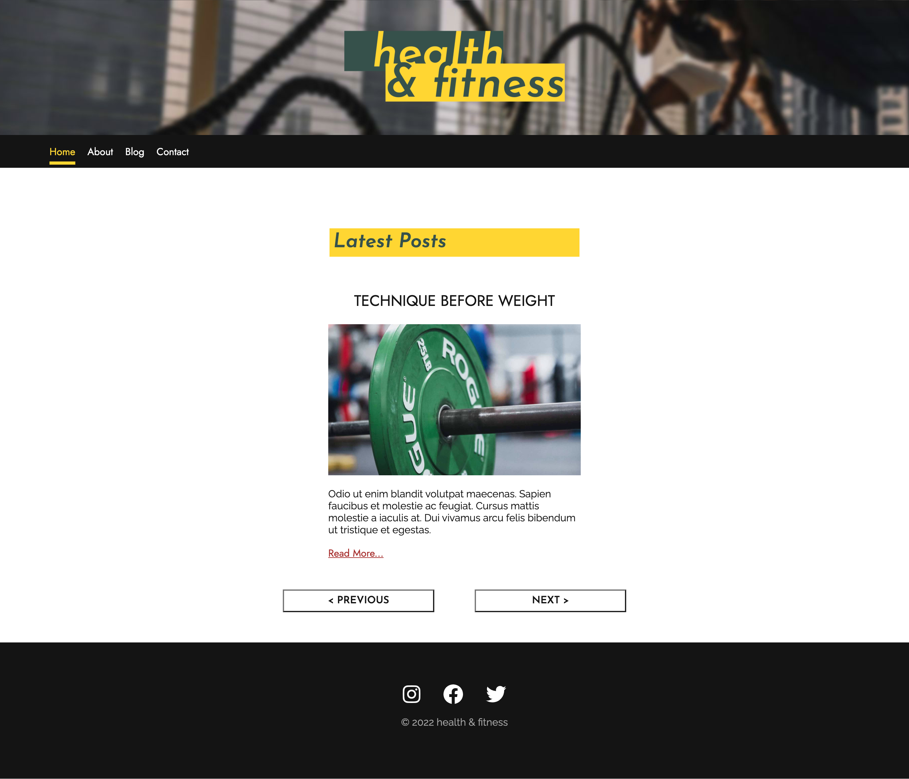

# Health & Fitness

## Description

This project was the exam for the first year of my studies at Noroff - Front-End Development.
The goal of the site is to put everything we have learned to use, and create a functioning website with dynamic API content.

The website had to include:

- Home Page
- About Page
- List of blog posts
- Blog post specific pages
- Contact page

## Built With

- [HTML](https://developer.mozilla.org/en-US/docs/Web/HTML)
- [CSS](https://developer.mozilla.org/en-US/docs/Web/CSS)
- [JavaScript](https://developer.mozilla.org/en-US/docs/Web/JavaScript)

## Getting Started

### Installing

You can install the project by clonng the github repo to your computer.

### Running

You can see a live version of the website by running the VSCode project with the Live Server extension.

## Contact

[My Twitter page](https://twitter.com/martinth0resen)

[My LinkedIn page](https://www.linkedin.com/in/martinthoresen/)

## Acknowledgments

FontAwesome for easy-access icons and fonts - [FontAwesome](https://fontawesome.com/)
Google Fonts for free, open-source fonts - [Google Fonts](https://fonts.google.com/)
